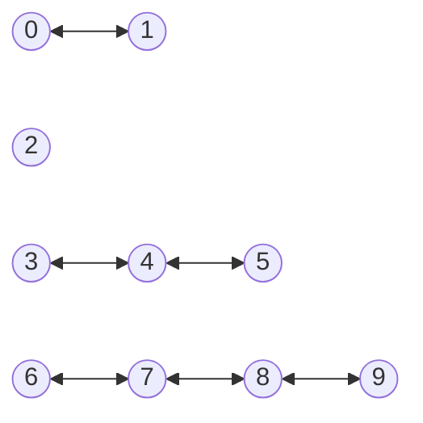

# Problem   P39158 from the Spanish Olimpics for Computer Science.

An archipelago is made up of N islands,  some of which are connected by P bidirectional bridges.

It is known that there is at most one bridge between each pair of islands.
They want to build hospitals so that no one has to cross more than one bridge to get to a hospital.

The problem is: What is the minimum number of hospitals needed?

Write a function that, given the number of islands N, the number of bridges P, and the connections array between the islands,
returns the minimum number of hospitals needed.

The connections array  consist of an array of P  pairs [x, y], with x not equal to y, containing the islands connected by each bridge. 

Assume N is greater than 1 and less or equal to 105, 

Assume P is between 0 and N, 

Assume that the islands are natural numbers numbered from 0, and 

Assume that there is no more than one bridge between two islands.

## Formulation in Spanish in the Second attempt

See file [LEEme](LEEme.md)

## Answer

Here is a capture of Chat GPT-3 answer:


See the code proposed by Chat-GPT in file [chat-gpt3-solution.js](chat-gpt3-solution.js)

When we run it with the input in file [input.txt](input.txt) we get:

```
➜  P31958_es git:(understanding-2nd-attempt) node chat-gpt3-solution.js
n = 10, p = 6, edges = [[0,1],[3,4],[4,5],[6,7],[7,8],[8,9]]
4
```

(I have added an additional sneak line to show the data structure used by the solution) 

But if we see the graph for file [input.txt](input.txt):



We realize that there is no solution with 4 hospitals and we need 5 to hold the restriction 
*They want to build hospitals so that no one has to cross more than one bridge to get to a hospital*