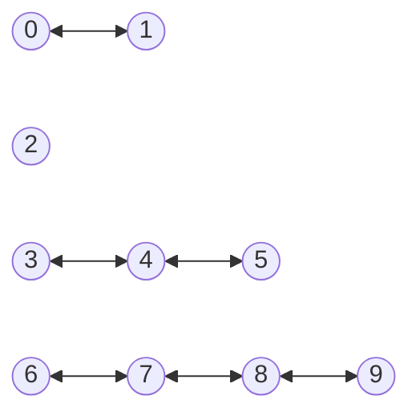
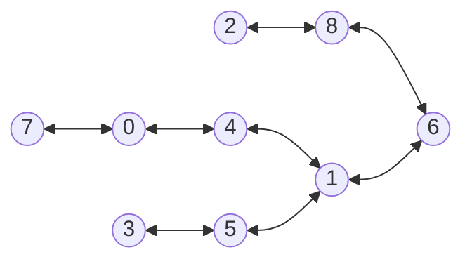
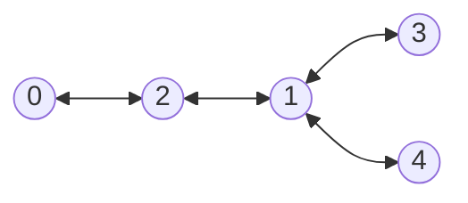

# Branch chat-gpt-4-allocation-problem

Here is a new formulation to chat-gpt-4 as a resource allocation problem.


## Formulating the question

### Q 

How can I solve the resource allocation problem in a graph? Assume I have a graph of nodes and edges and I have to allocate resources (say hospitals for instance) in a subset of the nodes in order guarantee that any node is served from a resource not far than 1 edge.

### A

The problem you are describing is called the **minimum dominating set problem**¹. It is a well-known problem in graph theory that has many applications in computer science, operations research, and other fields.

The minimum dominating set problem is defined as follows: given an undirected graph G = (V, E), find a minimum subset D of V such that every vertex not in D is adjacent to at least one vertex in D ¹. In your case, you want to find a minimum subset of nodes such that every node in the graph is within one edge of a node in the subset.

This problem is NP-hard ¹, which means that there is no known algorithm that can solve it efficiently for all instances of the problem. However, there are many approximation algorithms that can provide good solutions in practice ².

One such algorithm is called the **greedy algorithm** ². The greedy algorithm starts with an empty set and iteratively adds nodes to the set until every node in the graph is within one edge of a node in the set. At each iteration, it adds the node that covers the most uncovered nodes.

I hope this helps! Let me know if you have any other questions.

1. Origen: Conversación con Bing, 5/4/2023(1) Resource Allocation Problem - an overview | ScienceDirect Topics. https://www.sciencedirect.com/topics/engineering/resource-allocation-problem Con acceso 5/4/2023.
2. (2) Resource Allocation Graph (RAG) in Operating System. https://www.geeksforgeeks.org/resource-allocation-graph-rag-in-operating-system/ Con acceso 5/4/2023.
3. (3) Resource Allocation Problems | SpringerLink. https://link.springer.com/chapter/10.1007/978-1-4613-0303-9_14 Con acceso 5/4/2023.

### Q

Can you write a JavaScript solution?

### A 

Sure! Here's a JavaScript solution that uses the greedy algorithm I mentioned earlier:

```javascript
function minimumDominatingSet(graph) {
  const nodes = Object.keys(graph);
  const dominatingSet = new Set();

  while (nodes.length > 0) {
    let bestNode = null;
    let bestCount = -1;

    for (const node of nodes) {
      const neighbors = graph[node];
      const uncoveredNeighbors = neighbors.filter(n => !dominatingSet.has(n));

      if (uncoveredNeighbors.length > bestCount) {
        bestNode = node;
        bestCount = uncoveredNeighbors.length;
      }
    }

    dominatingSet.add(bestNode);
    nodes.splice(nodes.indexOf(bestNode), 1);
  }

  return dominatingSet;
}
```

The `graph` parameter is an object that maps each node to an array of its neighbors. For example, if you have a graph with nodes `A`, `B`, and `C`, where `A` is connected to `B` and `C`, you would represent it like this:

```javascript
{
  A: ['B', 'C'],
  B: ['A'],
  C: ['A']
}
```

The function returns a set of nodes that form a minimum dominating set.

I hope this helps! Let me know if you have any other questions.

Origen: Conversación con Bing, 5/4/2023(1) Minimum number of cameras required to cover all nodes in graph. https://stackoverflow.com/questions/58793494/minimum-number-of-cameras-required-to-cover-all-nodes-in-graph Con acceso 5/4/2023.
(2) Solving the k-dominating set problem on very large-scale networks .... https://computationalsocialnetworks.springeropen.com/articles/10.1186/s40649-020-00078-5 Con acceso 5/4/2023.
(3) Minimum-dominating set problem, Competitive programming. https://stackoverflow.com/questions/75804494/minimum-dominating-set-problem-competitive-programming Con acceso 5/4/2023.

## Conclusion

There were several errors in the  solution proposed by Chat-gpt-4.

I had to change `nodes` from an array to a Set for convenience.

The main error is that covered/dominated elements weren't supressed.

```js
    // Added by human. Missed this line
    for (const neighbor of graph[bestNode]) {
      //console.log(`Removing node ${neighbor} from the graph`);
      nodes.delete(String(neighbor));
    }
```

Here are some executions:

```
➜  P31958_es git:(chat-gpt-4-allocation-problem) node chat-gpt4-solution.js           
n = 10, p = 6, edges = [[0,1],[3,4],[4,5],[6,7],[7,8],[8,9]]}
graph = {"0":[1],"1":[0],"2":[],"3":[4],"4":[3,5],"5":[4],"6":[7],"7":[6,8],"8":[7,9],"9":[8]}
Set(5) { '4', '7', '0', '9', '2' }
➜  P31958_es git:(chat-gpt-4-allocation-problem) ✗ node chat-gpt4-solution.js input2.txt
n = 9, p = 8, edges = [[0,4],[7,0],[3,5],[8,6],[1,6],[2,8],[4,1],[5,1]]}
graph = {"0":[4,7],"1":[6,4,5],"2":[8],"3":[5],"4":[0,1],"5":[3,1],"6":[8,1],"7":[0],"8":[6,2]}
Set(4) { '1', '0', '8', '3' }
➜  P31958_es git:(chat-gpt-4-allocation-problem) ✗ node chat-gpt4-solution.js input3.txt
n = 5, p = 4, edges = [[0,2],[2,1],[1,3],[1,4]]}
graph = {"0":[2],"1":[2,3,4],"2":[0,1],"3":[1],"4":[1]}
Set(2) { '1', '0' }
```

## First instance

But the first example in file [input.txt](input.txt) is 

```
10 6
0 1
3 4
4 5
6 7
7 8
8 9
```

whose graph is:


## Second instance

Here is the second instance:

```
9 8
0 4
7 0
3 5
8 6
1 6
2 8
4 1
5 1
```

whose graph is:



and whose solution is 3.

The execution of the Chat GPT-3 solution gives 1, since all the items are in a connected component:

```
➜  P31958_es git:(understanding-2nd-attempt) ✗ node chat-gpt3-solution.js input2.txt 
n = 9, p = 8, edges = [[0,4],[7,0],[3,5],[8,6],[1,6],[2,8],[4,1],[5,1]]
Coloring island 0 with color 0. numHospitals=1
colors=[0,0,1,0,1,1,1,1,0]
1
```

## Third instance

The third given instance is:

```
5 4
0 2
2 1
1 3
1 4
```
whose graph is:



and whose solution is 2.

The execution gives:

```
➜  P31958_es git:(understanding-2nd-attempt) ✗ node chat-gpt3-solution.js input3.txt
n = 5, p = 4, edges = [[0,2],[2,1],[1,3],[1,4]]
Coloring island 0 with color 0. numHospitals=1
colors=[0,0,1,1,1]
1
```
