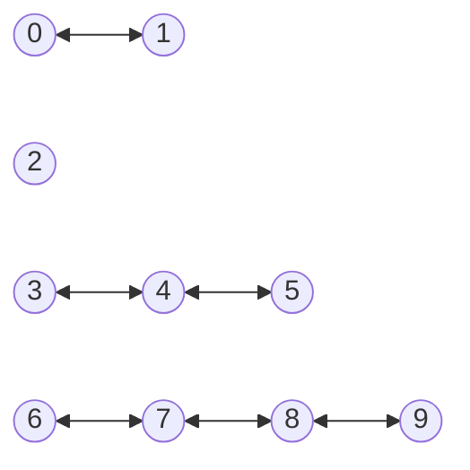
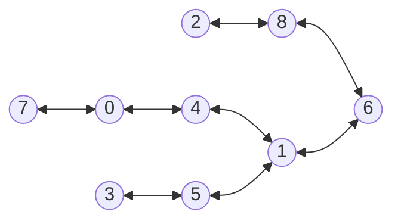
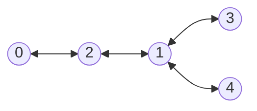

# Branch chat-gpt-4

Contains a solution using chat-gpt-4 (chat in Bing search, April 3d 2023).

## Formulating the question

I copy pasted the question as in file [LEEme.md](LEEme.md)

For the initial formulation see the pdf file [problem.pdf](problem.pdf)

See file [chat-gpt-4-solution.js](chat-gpt4-solution.js) in branch `chat-gpt-4`

Here is an execution with the program as described by chat-gpt-4:

```
➜  P31958_es git:(chat-gpt-4) ✗ node chat-gpt4-solution.js 
4 
```

And once modified to read from file in this branch we get for the other two instances:

```
➜  P31958_es git:(chat-gpt-4-human) ✗ node chat-gpt4-solution.js input2.txt
n = 9, p = 8, edges = [[0,4],[7,0],[3,5],[8,6],[1,6],[2,8],[4,1],[5,1]]}
1
➜  P31958_es git:(chat-gpt-4-human) ✗ node chat-gpt4-solution.js input3.txt
n = 5, p = 4, edges = [[0,2],[2,1],[1,3],[1,4]]}
1 
```

Which seems to give as answer the number of connected components.


That seems correct.


## First instance

But the first example in file [input.txt](input.txt) is 

```
10 6
0 1
3 4
4 5
6 7
7 8
8 9
```

whose graph is:


## Second instance

Here is the second instance:

```
9 8
0 4
7 0
3 5
8 6
1 6
2 8
4 1
5 1
```

whose graph is:



and whose solution is 3.

The execution of the Chat GPT-3 solution gives 1, since all the items are in a connected component:

```
➜  P31958_es git:(understanding-2nd-attempt) ✗ node chat-gpt3-solution.js input2.txt 
n = 9, p = 8, edges = [[0,4],[7,0],[3,5],[8,6],[1,6],[2,8],[4,1],[5,1]]
Coloring island 0 with color 0. numHospitals=1
colors=[0,0,1,0,1,1,1,1,0]
1
```

## Third instance

The third given instance is:

```
5 4
0 2
2 1
1 3
1 4
```
whose graph is:



and whose solution is 2.

The execution gives:

```
➜  P31958_es git:(understanding-2nd-attempt) ✗ node chat-gpt3-solution.js input3.txt
n = 5, p = 4, edges = [[0,2],[2,1],[1,3],[1,4]]
Coloring island 0 with color 0. numHospitals=1
colors=[0,0,1,1,1]
1
```
