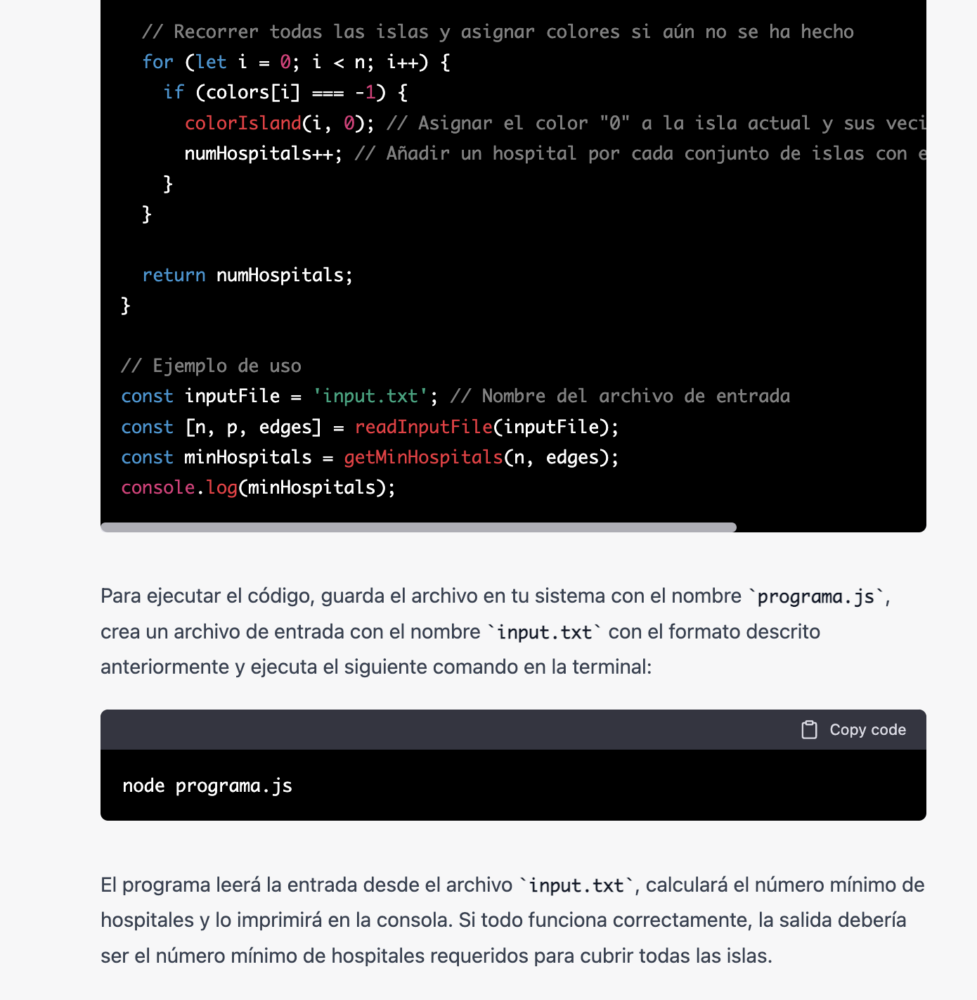

## Modifications in this branch `human`

This branch modifies the solution to sort the islands by number of neighbors in descending order.
Most of the program is like the one in branch `greedy-algorithm`

It improves in the first instance from 6 to 5:

```
➜  P31958_es git:(human) node chat-gpt3-solution.js           
n = 10, p = 6, edges = [[0,1],[3,4],[4,5],[6,7],[7,8],[8,9]] numNeighbors = [1,1,0,1,2,1,1,2,2,1]
Coloring island 4 with color 0. numComponents=1
Coloring island 7 with color 0. numComponents=2
Coloring island 0 with color 0. numComponents=3
Coloring island 2 with color 0. numComponents=4
colors=[0,1,0,1,0,1,1,0,1,0]
Hospitals: [0,2,4,7,9], numHospitals: 5
```

Ties to 4 with the second (but there is a solution with 3 hospitals):

```
➜  P31958_es git:(human) node chat-gpt3-solution.js input2.txt
n = 9, p = 8, edges = [[0,4],[7,0],[3,5],[8,6],[1,6],[2,8],[4,1],[5,1]] numNeighbors = [2,3,1,1,2,2,2,1,2]
Coloring island 1 with color 0. numComponents=1
colors=[0,0,1,0,1,1,1,1,0]
Hospitals: [0,1,3,8], numHospitals: 4
```

and ties to 2 also with the third:

```
➜  P31958_es git:(human) ✗ node chat-gpt3-solution.js input3.txt
n = 5, p = 4, edges = [[0,2],[2,1],[1,3],[1,4]] numNeighbors = [1,3,2,1,1]
Coloring island 1 with color 0. numComponents=1
colors=[0,0,1,1,1]
Hospitals: [0,1], numHospitals: 2
```

# Problem   P39158 from the Spanish Olimpics for Computer Science.

An archipelago is made up of N islands,  some of which are connected by P bidirectional bridges.

It is known that there is at most one bridge between each pair of islands.
They want to build hospitals so that no one has to cross more than one bridge to get to a hospital.

The problem is: What is the minimum number of hospitals needed?

Write a function that, given the number of islands N, the number of bridges P, and the connections array between the islands,
returns the minimum number of hospitals needed.

The connections array  consist of an array of P  pairs [x, y], with x not equal to y, containing the islands connected by each bridge. 

Assume N is greater than 1 and less or equal to 105, 

Assume P is between 0 and N, 

Assume that the islands are natural numbers numbered from 0, and 

Assume that there is no more than one bridge between two islands.

## Formulation in Spanish in the Second attempt

See file [LEEme](LEEme.md)

## Chat GPT-3 answer

Here is a capture of Chat GPT-3 answer:

[](chat-gpt3-solution.js)

[](chat-gpt3-solution.js)

See the code proposed by Chat-GPT in file [chat-gpt3-solution.js](chat-gpt3-solution.js)

When we run it with the input in file [input.txt](input.txt) we get:

```
➜  P31958_es git:(understanding-2nd-attempt) ✗ node chat-gpt3-solution.js
n = 10, p = 6, edges = [[0,1],[3,4],[4,5],[6,7],[7,8],[8,9]]
Coloring island 0 with color 0. numHospitals=1
Coloring island 2 with color 0. numHospitals=2
Coloring island 3 with color 0. numHospitals=3
Coloring island 6 with color 0. numHospitals=4
colors=[0,1,0,0,1,0,0,1,0,1]
4
```

I have added an additional sneak line to show the data structure used by the solution and another to show that numHospital is incremented when and only when a new unconnected component/island is found.

But the first example in file [input.txt](input.txt) is 

```
10 6
0 1
3 4
4 5
6 7
7 8
8 9
```

whose graph is:


We realize that there is no solution with 4 hospitals and we need 5 to hold the restriction 
**They want to build hospitals so that no one has to cross more than one bridge to get to a hospital**

Here is the code for the function `colorIsland(island, color)`:

```js 
// Función auxiliar para asignar un color a una isla y sus vecinas
  function colorIsland(island, color) {
    colors[island] = color;
    for (const [i, j] of edges) {
      if (i === island && colors[j] === -1) {
        colorIsland(j, 1 - color); // Asignar un color distinto al de la isla adyacente
      } else if (j === island && colors[i] === -1) {
        colorIsland(i, 1 - color); // Asignar un color distinto al de la isla adyacente
      }
    }
  }
```

It traverses the `edges` array looking for edges starting or finishing in the `island` and if the island on the other side of the bridge has not been colored it assigns `1 - color` ( a different color) to the neighbor island. 

See how `numHospitals` is increased when a new uncolored island (i.e. a new unconnected component) is found:

```js 
  // Recorrer todas las islas y asignar colores si aún no se ha hecho
  for (let i = 0; i < n; i++) {
    if (colors[i] === -1) {
      colorIsland(i, 0); // Asignar el color "0" a la isla actual y sus vecinas
      numHospitals++; // Añadir un hospital por cada conjunto de islas con el mismo color
      // added by human
      console.log(`Coloring island ${i} with color 0. numHospitals=${numHospitals}`)
    }
  }
```

Therefore the solution is wrong and what `numHospitals` contains is the number of connected components. 

## Second instance

Here is the second instance:

```
9 8
0 4
7 0
3 5
8 6
1 6
2 8
4 1
5 1
```

whose graph is:


and whose solution is 3.

The execution of the Chat GPT-3 solution gives 1, since all the items are in a connected component:

```
➜  P31958_es git:(understanding-2nd-attempt) ✗ node chat-gpt3-solution.js input2.txt 
n = 9, p = 8, edges = [[0,4],[7,0],[3,5],[8,6],[1,6],[2,8],[4,1],[5,1]]
Coloring island 0 with color 0. numHospitals=1
colors=[0,0,1,0,1,1,1,1,0]
1
```

## Third instance

The third given instance is:

```
5 4
0 2
2 1
1 3
1 4
```
whose graph is:


and whose solution is 2.

The execution gives:

```
➜  P31958_es git:(understanding-2nd-attempt) ✗ node chat-gpt3-solution.js input3.txt
n = 5, p = 4, edges = [[0,2],[2,1],[1,3],[1,4]]
Coloring island 0 with color 0. numHospitals=1
colors=[0,0,1,1,1]
1
```

## Reformulating the question as a location-allocation problem


* **Q:** How can I solve the resource allocation problem in a graph?

Assume I have a graph of nodes  and edges and I have to allocate resources (say hospitals for instance) in a subset of the nodes in order guarantee that any node is served from a resource not far than 1 edge.

* **A:** The resource allocation problem in a graph with the requirement that any node should be served by a resource not far than 1 edge can be solved using graph coloring algorithms.

The first step is to identify the subset of nodes where resources (hospitals) need to be allocated. Once the subset of nodes is identified, a graph coloring algorithm can be used to allocate resources in such a way that no two adjacent nodes have the same color (i.e., no two nodes that share an edge have the same resource). This ensures that each node is served by a resource not far than 1 edge.

One such algorithm is the greedy graph coloring algorithm. The algorithm assigns the first color to the first node and then iterates through the remaining nodes, assigning the lowest possible color that has not been assigned to any of its neighbors. The algorithm continues until all nodes are assigned a color.

Another algorithm that can be used is the backtracking algorithm. This algorithm recursively assigns colors to nodes and backtracks if a node cannot be assigned a color without violating the 1-edge constraint.

Both algorithms have their pros and cons, and the choice of algorithm will depend on the size and complexity of the graph. However, both algorithms are effective for solving the resource allocation problem in a graph with the 1-edge constraint.
