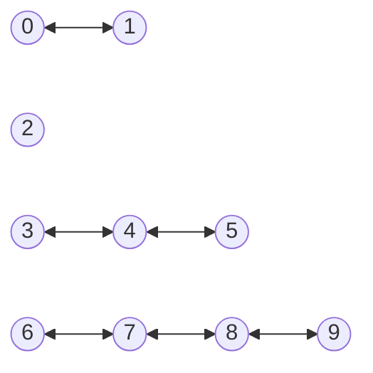
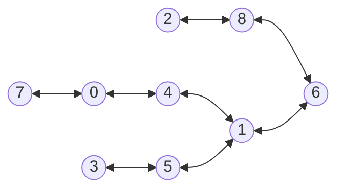
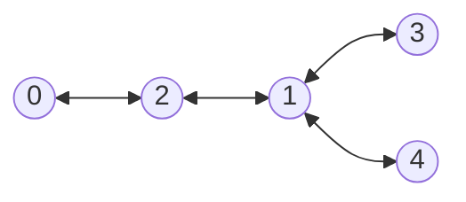

### Coromoto León-Hernandez. Casiano  Rodriguez-Leon 

Universidad de La Laguna

## Introducción

Desde que GitHub introdujo GitHub copilot en Junio de 2021 y en los cursos 21/22 y 22/23 hemos estado usando no sólo GH Copilot sin también Chat-GPT-3 y 4 en nuestra docencia, en la elaboración y preparación de clases, ejercicios y prácticas e investigando como los alumnos pueden beneficiarse de los mismos. Con la  añadido Chat-GPT en sus versiones 3 y 4.

## Objetivos

Este [repositorio Computational-Thinking/ia-assistant-olimpics](https://github.com/Computational-Thinking/ia-assistant-olimpics) y este [artículo](https://computational-thinking.github.io/ia-assistant-olimpics/) contienen el material, informe y conclusiones 
de una investigación que nos planteamos los autores sobre el uso de los asistentes IA en la enseñanza de la programación.

Nuestro objetivo es evaluar y comparar las capacidades de los diferentes asistentes IA para proveer soluciones a problemas como los que se plantean en la enseñanza de la programación.

### Asistentes IA utilizados

Decidimos usar todos los asistentes IA a nuestro alcance: Chat-GPT 3 y 4 y GitHub Copilot.
Nos hubiera gustado probar GitHub Copilot X pero en el momento de hacer el estudio no tenemos acceso al mismo.

### Problema

Para medir las capacidades de los asistentes IA planteamos un problema de las Olimpiadas de Informática Española. El problema elegido ha sido el [P31958_es](pdfs/problem.pdf) que hemos tomado de [jutge.org](https://jutge.org/problems/P31958_es)

## Casos de Ejemplo del Problema

### Primer caso

El primer ejemplo que puede encontrar en el fichero [input.txt](/input-examples/input.txt) es

```
10 6
0 1
3 4
4 5
6 7
7 8
8 9
```

Cuyo grafo es:



Es fácil ver que es posible encontrar una solución con 5 hospitales.

### Segundo caso

El segundo ejemplo que puede encontrar en el fichero [input2.txt](/input-examples/input2.txt) es 

```
9 8
0 4
7 0
3 5
8 6
1 6
2 8
4 1
5 1
```

cuyo grafo es:



Es posible encontrar una solución con 3 hospitales, poniéndolos en 0, 5 y 8.

### Tercer caso

El tercer ejemplo que puede encontrar en el fichero [input3.txt](/input-examples/input3.txt) es 

```
5 4
0 2
2 1
1 3
1 4
```

Cuyo grafo es:




y que puede resolverse con solo 2 hospitales.


## Experimentos

En este [repositorio][Repositorio] existen las siguientes ramas que se corresponden a diferentes experimentos con diferentes IAs:

```
➜  docs git:(main) ✗ git -P branch
  chat-gpt-3
  chat-gpt-4
+ chat-gpt-4-allocation-problem
  chat-gpt-4-human
  chat-gpt3-human
  chat-gpt3-human-sortedbynumedges
* main
```

### GitHub Copilot

Como señala [Pastor Marzo 2023][Pastor] 
> De hecho, tras la prueba (Brais) confirmaba cómo Copilot "tiene un enfoque más orientado a resolver tareas cotidianas basado en código semejante ya publicado". Es algo que ya se conocía, pero GitHub Copilot básicamente hace un copia/pega de algo que ya ha hecho literalmente otra persona. Al asistente de GitHub "se le da peor entender una premisa compleja".

Esta capacidad da lugar a que ocurran anécdotas como en esta clase de Procesadores de Lenguajes impartida el 24 de Mayo de 2022 en la que estudiamos como realizar un examen en el que se pide que construyamos un traductor para el lenguaje de las expresiones regulares. Durante la clase, GH Copilot se adelanta en varias ocasiones a los alumnos en dar la respuesta correcta a las preguntas del profesor (Véase por ejemplo minutos del 30 al 32)

<youtube id="bxadjvhtffs"></youtube>

Sin embargo GitHub Copilot no fue capaz de entender la formulación del [problema P31958_es][P31958_es] ni de hacer ningún progreso. Cuando se le formula entra en un bucle enloquecido en el que repite los mismo comentarios una y otra vez.


No hemos podido probar la nueva versión experimental de GitHub Copilot-X basada en Chat-gpt-4.


### Chat-GPT-3

La rama [chat-gpt-3](https://github.com/Computational-Thinking/ia-assistant-olimpics/tree/chat-gpt-3) contiene la solución propuesta por chat-gpt-3.  Esta es la idea que usa:

::: tip propuesta de chat-gpt-3
Una posible solución al problema es utilizar el algoritmo de coloración de grafos conocido como "Greedy Coloring". La idea es ir asignando un color a cada isla de tal forma que islas adyacentes no tengan el mismo color. El número mínimo de colores necesarios para colorear todas las islas es entonces igual al número mínimo de hospitales necesarios
::: 

Aunque la idea es correcta, La solución proveída por [chat-gpt-3][chat-gpt3]

```js{21}
function getMinHospitals(n, edges) {
  const colors = new Array(n).fill(-1); // Array para almacenar los colores asignados a cada isla
  let numHospitals = 0; // Contador de hospitales

  // Función auxiliar para asignar un color a una isla y sus vecinas
  function colorIsland(island, color) {
    colors[island] = color;
    for (const [i, j] of edges) {
      if (i === island && colors[j] === -1) {
        colorIsland(j, 1 - color); // Asignar un color distinto al de la isla adyacente
      } else if (j === island && colors[i] === -1) {
        colorIsland(i, 1 - color); // Asignar un color distinto al de la isla adyacente
      }
    }
  }

  // Recorrer todas las islas y asignar colores si aún no se ha hecho
  for (let i = 0; i < n; i++) {
    if (colors[i] === -1) {
      colorIsland(i, 0); // Asignar el color "0" a la isla actual y sus vecinas
      numHospitals++; // Añadir un hospital por cada conjunto de islas con el mismo color
      // added by human
      console.log(`Coloring island ${i} with color 0. numHospitals=${numHospitals}`)
    }
  }

  // added by human
  console.log(`colors=${JSON.stringify(colors)}`);

  return numHospitals;
}
```
incrementa `numHospitals` cada vez que se encuentra una nueva componente conexa.
Cuando se ejecuta el programa que proporciona, los resultados son erróneos.

Cuando lo ejecutamos con la entrada en el archivo [input.txt](#primer-caso) obtenemos:

```
➜  P31958_es git:(understanding-2nd-attempt) ✗ node chat-gpt3-solution.js
n = 10, p = 6, edges = [[0,1],[3,4],[4,5],[6,7],[7,8],[8,9]]
Coloring island 0 with color 0. numHospitals=1
Coloring island 2 with color 0. numHospitals=2
Coloring island 3 with color 0. numHospitals=3
Coloring island 6 with color 0. numHospitals=4
colors=[0,1,0,0,1,0,0,1,0,1]
4
```

La rama [chat-gpt-3-human][chat-gpt3-human] contiene la solución propuesta por chat-gpt-3 modificada por un programador para que la salida muestre los resultados correctos. En el siguiente código coloreado aparecen en rojo las modificaciones hechas por el humano y en verde como estaba la línea que propuso chat-gpt-3:

```diff 
// Función para obtener el número mínimo de hospitales
-function getHospitals(n, edges) {
+function getMinHospitals(n, edges) {
   const colors = new Array(n).fill(-1); // Array para almacenar los colores asignados a cada isla
-  let numComponents = 0; // Contador de hospitales
+  let numHospitals = 0; // Contador de hospitales
 
   // Función auxiliar para asignar un color a una isla y sus vecinas
   function colorIsland(island, color) {
@@ -104,21 +87,20 @@ function getHospitals(n, edges) {
   for (let i = 0; i < n; i++) {
     if (colors[i] === -1) {
       colorIsland(i, 0); // Asignar el color "0" a la isla actual y sus vecinas
-      numComponents++; // Añadir un hospital por cada conjunto de islas con el mismo color
+      numHospitals++; // Añadir un hospital por cada conjunto de islas con el mismo color
       // added by human
-      console.log(`Coloring island ${i} with color 0. numComponents=${numComponents}`)
+      console.log(`Coloring island ${i} with color 0. numHospitals=${numHospitals}`)
     }
   }
 
   // added by human
   console.log(`colors=${JSON.stringify(colors)}`);
 
-  // Modified by human
-  return [...colors.keys()].filter(i => colors[i] == 0);
+  return numHospitals;
 }
 ```

La rama [chat-gpt3-human-sortedbynumedges][chat-gpt3-human-sortedbynumedges] es una modificación de la solución en `chat-gpt-3-human` con una modificación que ordena primero las islas por número de puentes y después aplica el algoritmo de coloración encontrado por chat-gpt-3 lo que hace que mejore en el primer caso de 6 a 5:

```
➜  P31958_es git:(human) node chat-gpt3-solution.js           
n = 10, p = 6, edges = [[0,1],[3,4],[4,5],[6,7],[7,8],[8,9]] numNeighbors = [1,1,0,1,2,1,1,2,2,1]
Coloring island 4 with color 0. numComponents=1
Coloring island 7 with color 0. numComponents=2
Coloring island 0 with color 0. numComponents=3
Coloring island 2 with color 0. numComponents=4
colors=[0,1,0,1,0,1,1,0,1,0]
Hospitals: [0,2,4,7,9], numHospitals: 5
```

### Chat-GPT-4 

La rama [chat-gpt-4-human](https://github.com/Computational-Thinking/ia-assistant-olimpics/tree/chat-gpt-4-human) contiene una solución propuesta por chat-gpt-4. 

::: tip Propuesta de chat-gpt-4
Para resolver este problema, se puede utilizar el algoritmo 
de coloración de grafos, que consiste en asignar un color a 
cada vértice de tal forma que dos vértices adyacentes 
no tengan el mismo color. En este caso, los vértices representan 
las islas y las aristas representan los puentes.
El número mínimo de hospitales necesarios es igual al 
número cromático del grafo, es decir, 
el número mínimo de colores necesarios para colorear el 
grafo de tal forma que dos vértices adyacentes no tengan el mismo color.
:::

Además proporciona citas:

::: tip Citas
* Origen: Conversación con Bing, 4/4/2023(1) Leer archivos en JavaScript. https://web.dev/i18n/es/read-files/ Con acceso 4/4/2023.
* (2) Leer archivo de texto en JavaScript | Delft Stack. https://www.delftstack.com/es/howto/javascript/read-text-file-in-javascript/ Con acceso 4/4/2023.
* (3) Leer archivo línea por línea en JavaScript | Delft Stack. https://www.delftstack.com/es/howto/javascript/javascript-read-file-line-by-line/ Con acceso 4/4/2023.
* (4) Cómo leer un archivo de texto con código de Javascript en HTML (En 6 .... https://techlandia.com/leer-archivo-texto-codigo-javascript-html-como_43910/ Con acceso 4/4/2023.
* (5) html - ¿Cómo leer un archivo .txt desde JavaScript? - Stack Overflow en .... https://es.stackoverflow.com/questions/54734/c%C3%B3mo-leer-un-archivo-txt-desde-javascript Con acceso 4/4/2023.
* (6) Lectura de archivos con JavaScript - Stack Overflow en español. https://es.stackoverflow.com/questions/193178/lectura-de-archivos-con-javascript Con acceso 4/4/2023.
* (7) Cómo leer un archivo de texto con código de Javascript en HTML (En 6 .... https://techlandia.com/leer-archivo-texto-codigo-javascript-html-como_43910/ Con acceso 4/4/2023.
::: 

La solución en la rama [chat-gpt-4-human][chat-gpt-4-human] contiene una ligera modificación de una solución proveída por chat-gpt-4 después de solicitarle una segunda respuesta. En este caso provee una heurística basada en un algoritmo Depth First Search:

```js
function DFS(p, v, visited, adj, colors) {
    visited[v] = true;
    colors[v] = (p !== null)? 1 - colors[p] : 0;
    console.error(`coloring ${v} of color ${colors[v]} with parent ${p}`)
    for (let i = 0; i < adj[v].length; i++) {
        if (!visited[adj[v][i]]) {
            DFS(v, adj[v][i], visited, adj, colors);
        }
    }
}

function minHospitals(n, edges) {
    let adj = new Array(n).fill(null).map(() => []);
    let visited = new Array(n).fill(false);
    let colors = new Array(n).fill(null);

    let numComponents = 0;
    for (let i = 0; i < edges.length; i++) {
        let u = edges[i][0];
        let v = edges[i][1];
        adj[u].push(v);
        adj[v].push(u);
    }
    for (let i = 0; i < n; i++) {
        if (!visited[i]) {
            DFS(null, i, visited, adj, colors);
            numComponents++;
        }
    }
    return { numComponents, colors, numHospitals: colors.filter(c => c == 0).length };
}
```

La rama `chat-gpt-4-human` ha sido  modificada por un programador para que la salida muestre resultados correctos.

```
➜  chat-gpt-4 git:(chat-gpt-4-human) node chat-gpt4-solution.js input.txt 
n = 10, p = 6, edges = [[0,1],[3,4],[4,5],[6,7],[7,8],[8,9]]}
coloring 0 of color 0 with parent null
coloring 1 of color 1 with parent 0
coloring 2 of color 0 with parent null
coloring 3 of color 0 with parent null
coloring 4 of color 1 with parent 3
coloring 5 of color 0 with parent 4
coloring 6 of color 0 with parent null
coloring 7 of color 1 with parent 6
coloring 8 of color 0 with parent 7
coloring 9 of color 1 with parent 8
{
  numComponents: 4,
  colors: [
    0, 1, 0, 0, 1,
    0, 0, 1, 0, 1
  ],
  numHospitals: 6
}
➜  chat-gpt-4 git:(chat-gpt-4-human) node chat-gpt4-solution.js input2.txt
n = 9, p = 8, edges = [[0,4],[7,0],[3,5],[8,6],[1,6],[2,8],[4,1],[5,1]]}
coloring 0 of color 0 with parent null
coloring 4 of color 1 with parent 0
coloring 1 of color 0 with parent 4
coloring 6 of color 1 with parent 1
coloring 8 of color 0 with parent 6
coloring 2 of color 1 with parent 8
coloring 5 of color 1 with parent 1
coloring 3 of color 0 with parent 5
coloring 7 of color 1 with parent 0
{
  numComponents: 1,
  colors: [
    0, 0, 1, 0, 1,
    1, 1, 1, 0
  ],
  numHospitals: 4
}
➜  chat-gpt-4 git:(chat-gpt-4-human) node chat-gpt4-solution.js input3.txt
n = 5, p = 4, edges = [[0,2],[2,1],[1,3],[1,4]]}
coloring 0 of color 0 with parent null
coloring 2 of color 1 with parent 0
coloring 1 of color 0 with parent 2
coloring 3 of color 1 with parent 1
coloring 4 of color 1 with parent 1
{ numComponents: 1, colors: [ 0, 0, 1, 1, 1 ], numHospitals: 2 }
```

La rama `chat-gpt-4-allocation-problem` contiene la solución propuesta por chat-gpt-4 y modificada por un programador a partir de una reformulación del problema diferente a la del enunciado usado en la olimpiada. `chat-gpt-4` provee en este caso un algoritmo heurístico con backtracking.

En la rama `main` se documenta la experiencia.


## Referencias

* [jutge.org: Problema P31958_es](https://jutge.org/problems/P31958_es)
* Repositorio Computational-Thinking/ia-assistant-olimpics](https://github.com/Computational-Thinking/ia-assistant-olimpics)
* [GitHub Copilot AI pair programmer: Asset or Liability?](https://arxiv.org/pdf/2206.15331.pdf) Arghavan Moradi Dakhel, Vahid Majdinasab, Amin Nikanjam, Foutse Khomh, Michel C. Desmarais, Zhen Ming (Jack)Jiang Jun 2022
* James Finnie-Ansley, Paul Denny, Brett A. Becker, Andrew Luxton-Reilly, and James Prather. 2022. [The Robots Are Coming: Exploring the Implications of OpenAI Codex on Introductory Programming](https://dl.acm.org/doi/10.1145/3511861.3511863#sec-comments). In Proceedings of the 24th Australasian Computing Education Conference (ACE '22). Association for Computing Machinery, New York, NY, USA, 10–19. <https://doi.org/10.1145/3511861.3511863>
* [Copilot, ChatGPT y GPT-4 han cambiado el mundo de la programación para siempre. Esto opinan los programadores](https://www.xataka.com/servicios/copilot-chatgpt-gpt-4-han-cambiado-para-siempre-mundo-programacion-esto-que-opinan-expertos). Javier Pastor. 28 Marzo 20223. Entrevista con Brais Moore y Miguel Angel Durán. Xataca.com
* Seminario sobre inteligencia artificial y docencia universitaria de la ULL
  
  <youtube id="Os2fNi5LXZQ"></youtube>

  30 de Marzo 2023

[Pastor]: https://www.xataka.com/servicios/copilot-chatgpt-gpt-4-han-cambiado-para-siempre-mundo-programacion-esto-que-opinan-expertos
[Repositorio]: https://github.com/Computational-Thinking/ia-assistant-olimpics
[P31958_es]: https://jutge.org/problems/P31958_es
[chat-gpt3]: https://github.com/Computational-Thinking/ia-assistant-olimpics/blob/chat-gpt-3/chat-gpt3-solution.js
[chat-gpt3-human]: https://github.com/Computational-Thinking/ia-assistant-olimpics/blob/chat-gpt3-human/chat-gpt3-solution.js#L87-L118

[chat-gpt3-human-sortedbynumedges]: https://github.com/Computational-Thinking/ia-assistant-olimpics/blob/chat-gpt3-human-sortbynumedges/chat-gpt3-solution.js#L115-L116

[chat-gpt-4]: https://github.com/Computational-Thinking/ia-assistant-olimpics/blob/chat-gpt-4/chat-gpt4-solution.js#L41-L68
[chat-gpt-4-human]: https://github.com/Computational-Thinking/ia-assistant-olimpics/blob/chat-gpt-4-human/chat-gpt4-solution.js#L17-L47