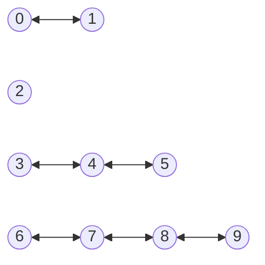
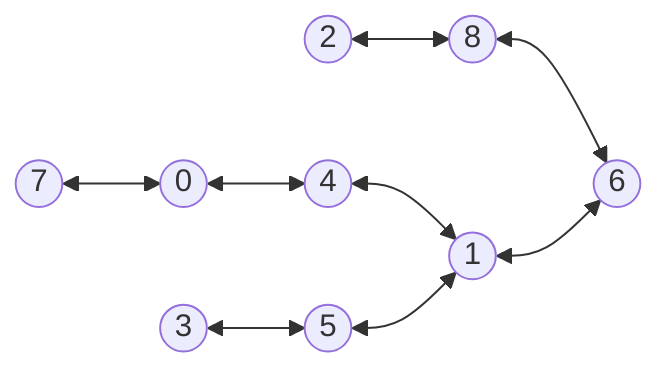
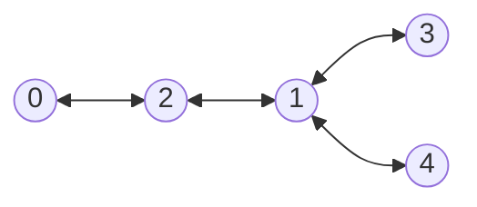

### Coromoto León-Hernandez. Casiano  Rodriguez-Leon 

Universidad de La Laguna

## Introducción

Desde que GitHub introdujo GitHub copilot en Junio de 2021 y en los cursos 21/22 y 22/23 hemos estado usando no sólo GH Copilot sin también Chat-GPT-3 y 4 en nuestra docencia, en la elaboración y preparación de clases, ejercicios y prácticas e investigando como los alumnos pueden beneficiarse de los mismos. Con la  añadido Chat-GPT en sus versiones 3 y 4.

## Objetivos

Este [repositorio Computational-Thinking/ia-assistant-olimpics](https://github.com/Computational-Thinking/ia-assistant-olimpics) y este [artículo](https://computational-thinking.github.io/ia-assistant-olimpics/) contienen el material, informe y conclusiones 
de una investigación que nos planteamos los autores sobre el uso de los asistentes IA en la enseñanza de la programación.

Nuestro objetivo es evaluar y comparar las capacidades de los diferentes asistentes IA para proveer soluciones a problemas como los que se plantean en la enseñanza de la programación.

### Asistentes IA utilizados

Decidimos usar todos los asistentes IA a nuestro alcance: Chat-GPT 3 y 4 y GitHub Copilot.
Nos hubiera gustado probar GitHub Copilot X pero en el momento de hacer el estudio no tenemos acceso al mismo.

### Problema

Para medir las capacidades de los asistentes IA planteamos un problema de las Olimpiadas de Informática Española. El problema elegido ha sido el [P31958_es](pdfs/problem.pdf) que hemos tomado de [jutge.org](https://jutge.org/problems/P31958_es)

## Casos de Ejemplo del Problema

### Primer caso

El primer ejemplo que puede encontrar en el fichero [input.txt](/input-examples/input.txt) es

```
10 6
0 1
3 4
4 5
6 7
7 8
8 9
```

Cuyo grafo es:



Es fácil ver que es posible encontrar una solución con 5 hospitales.

### Segundo caso

El segundo ejemplo que puede encontrar en el fichero [input2.txt](/input-examples/input2.txt) es 

```
9 8
0 4
7 0
3 5
8 6
1 6
2 8
4 1
5 1
```

cuyo grafo es:



Es posible encontrar una solución con 3 hospitales, poniéndolos en 0, 5 y 8.

### Tercer caso

El tercer ejemplo que puede encontrar en el fichero [input3.txt](/input-examples/input3.txt) es 

```
5 4
0 2
2 1
1 3
1 4
```

Cuyo grafo es:




y que puede resolverse con solo 2 hospitales.


## Experimentos

En este repositorio existen las siguientes ramas que se corresponden a diferentes experimentos con diferentes IAs:

```
➜  docs git:(main) ✗ git -P branch
  chat-gpt-3
  chat-gpt-4
+ chat-gpt-4-allocation-problem
  chat-gpt-4-human
  chat-gpt3-human
  chat-gpt3-human-sortedbynumedges
* main
```

### GitHub Copilot

GitHub Copilot no fue capaz de entender la formulación del problema ni de hacer ningún progreso. Cuando se le formula entra en un bucle enloquecido en el que repite los mismo comentarios una y otra vez.

No hemos podido probar la nueva versión experimental de GitHub Copilot-X basada en Chat-gpt-4.


### Las ramas chat-gpt-3 del repo Computational-Thinking/ia-assistant-olimpics

La rama [chat-gpt-3](https://github.com/Computational-Thinking/ia-assistant-olimpics/tree/chat-gpt-3) contiene la solución propuesta por chat-gpt-3.  Esta es la idea que usa:

::: tip propuesta de chat-gpt-3
Una posible solución al problema es utilizar el algoritmo de coloración de grafos conocido como "Greedy Coloring". La idea es ir asignando un color a cada isla de tal forma que islas adyacentes no tengan el mismo color. El número mínimo de colores necesarios para colorear todas las islas es entonces igual al número mínimo de hospitales necesarios
::: 

Aunque la idea es correcta, cuando se ejecuta el programa que proporciona, los resultados son erróneos.


La rama `chat-gpt-3-human` contiene la solución propuesta por chat-gpt-3 modificada por un programador para que la salida muestre los resultados correctos.

La rama `chat-gpt3-human-sortedbynumedges` es una modificación de la solución en `chat-gpt-3-human` con una modificación que ordena primero ls islas por número de puentes y después aplica el algoritmo de coloración encontrado por chat-gpt-3.

### Las ramas chat-gpt-4 del repo Computational-Thinking/ia-assistant-olimpics

La rama [chat-gpt-4](https://github.com/Computational-Thinking/ia-assistant-olimpics/tree/chat-gpt-4) contiene la solución propuesta por chat-gpt-4. 
Ofrece la misma aproximación que 3, pero se explica mejor:

::: tip Propuesta de chat-gpt-4
Para resolver este problema, se puede utilizar el algoritmo 
de coloración de grafos, que consiste en asignar un color a 
cada vértice de tal forma que dos vértices adyacentes 
no tengan el mismo color. En este caso, los vértices representan 
las islas y las aristas representan los puentes.
El número mínimo de hospitales necesarios es igual al 
número cromático del grafo, es decir, 
el número mínimo de colores necesarios para colorear el 
grafo de tal forma que dos vértices adyacentes no tengan el mismo color.
:::

Además proporciona citas:

::: tip Citas
* Origen: Conversación con Bing, 4/4/2023(1) Fundamentos de JavaScript - Aprende sobre desarrollo web | MDN - Mozilla. https://developer.mozilla.org/es/docs/Learn/Getting_started_with_the_web/JavaScript_basics Con acceso 4/4/2023.
* (2) Ejemplos prácticos de Javascript (I) | Observatorio Tecnológico. http://recursostic.educacion.es/observatorio/web/gl/software/programacion/490-lorena-arranz Con acceso 4/4/2023.
* (3) JavaScript - Technical University of Valencia. https://lemus.webs.upv.es/wordpress/wp-content/uploads/2018/07/javascript-es6-ejercicios-resueltos-parte-1.pdf Con acceso 4/4/2023.
::: 

Sin embargo, **al igual que con gpt-3, los resultados proveídos por el programa son erróneos**.

* La rama `chat-gpt-4-human` contiene la solución propuesta por chat-gpt-4 modificada por un programador para que la salida muestre resultados correctos.
* La rama `chat-gpt-4-allocation-problem` contiene la solución propuesta por chat-gpt-4 y modificada por un programador a partir de una reformulación del problema diferente a la del enunciado usado en la olimpiada. `chat-gpt-4` provee en este caso un algoritmo heurístico con backtracking.

En la rama `main` se documenta la experiencia.


## Referencias

* [jutge.org](https://jutge.org/problems/P31958_es)
* [GitHub Copilot AI pair programmer: Asset or Liability?](https://arxiv.org/pdf/2206.15331.pdf) Arghavan Moradi Dakhel, Vahid Majdinasab, Amin Nikanjam, Foutse Khomh, Michel C. Desmarais, Zhen Ming (Jack)Jiang Jun 2022
* James Finnie-Ansley, Paul Denny, Brett A. Becker, Andrew Luxton-Reilly, and James Prather. 2022. [The Robots Are Coming: Exploring the Implications of OpenAI Codex on Introductory Programming](https://dl.acm.org/doi/10.1145/3511861.3511863#sec-comments). In Proceedings of the 24th Australasian Computing Education Conference (ACE '22). Association for Computing Machinery, New York, NY, USA, 10–19. <https://doi.org/10.1145/3511861.3511863>
