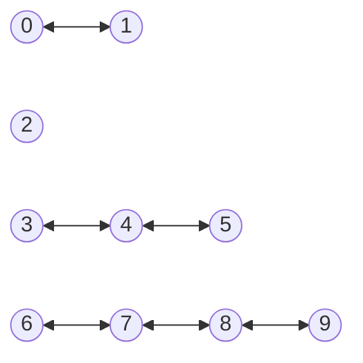
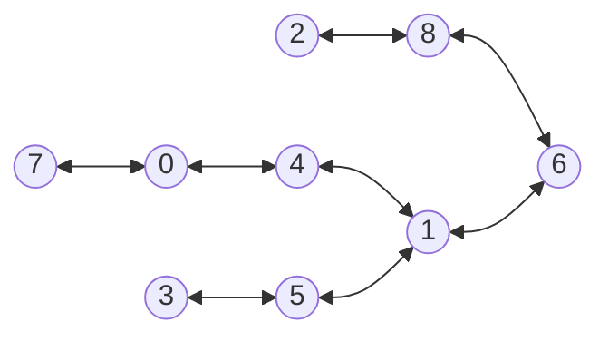
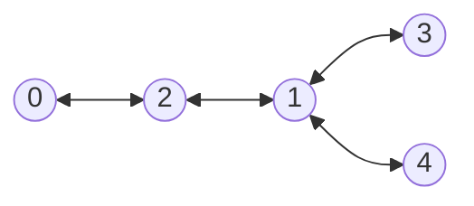

## Objetivos

Este repositorio y este artículo contienen el material, informe y conclusiones 
de una investigación que nos planteamos los autores sobre el uso de los asistentes IA en la enseñanza de la programación.

Nuestro objetivo es evaluar y comparar las capacidades de los diferentes asistentes IA para proveer soluciones a problemas como los que se plantean en la enseñanza de la programación.

### Asistentes IA utilizados

Decidimos usar todos los asistentes IA a nuestro alcance: Chat-GPT 3 y 4 y GitHub Copilot.
Nos hubiera gustado probar GitHub Copilot X pero en el momento de hacer el estudio no tenemos acceso al mismo.

### Problema

Para medir las capacidades de los asistentes IA planteamos un problema de las Olimpiadas de Informática Española. El problema elegido ha sido el [P31958_es](pdfs/problem.pdf) que hemos tomado de [jutge.org](https://jutge.org/problems/P31958_es)

## Casos de Ejemplo del Problema

### Primer caso

El primer ejemplo que puede encontrar en el fichero [input.txt](/input-examples/input.txt) es

```
10 6
0 1
3 4
4 5
6 7
7 8
8 9
```

Cuyo grafo es:



Es fácil ver que es posible encontrar una solución con 5 hospitales.

### Segundo caso

El segundo ejemplo que puede encontrar en el fichero [input2.txt](/input-examples/input2.txt) es 

```
9 8
0 4
7 0
3 5
8 6
1 6
2 8
4 1
5 1
```

cuyo grafo es:



Es posible encontrar una solución con 3 hospitales, poniéndolos en 0, 5 y 8.

### Tercer caso

El tercer ejemplo que puede encontrar en el fichero [input3.txt](/input-examples/input3.txt) es 

```
5 4
0 2
2 1
1 3
1 4
```
whose graph is:



y que puede resolverse con solo 2 hospitales.


## Referencias

* [jutge.org](https://jutge.org/problems/P31958_es)